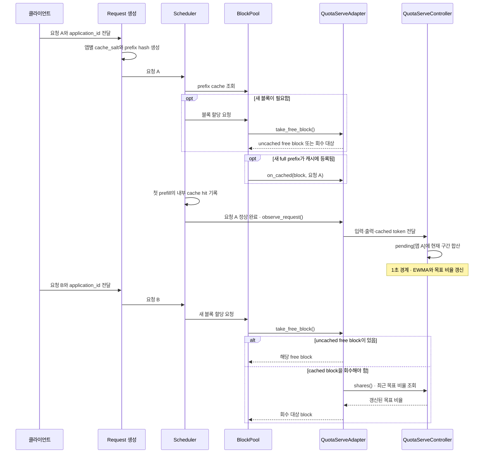

# QuotaServe 구현 가이드

이 문서는 [QuotaServe 논문 초안](../../../JJ-distributed-LLM-inference/docs/QUOTASERVE_PAPER.md)의 §2.1–2.5가 현재 vLLM 코드에서 어떻게 구현되는지 설명한다. 실험 준비와 서버 실행 명령은 [002 실험 README](../../../JJ-distributed-LLM-inference/002_quotaserve_experiment/README.md)에 있다.

QuotaServe는 새 요청에 블록을 할당할 때 **캐시된 free block을 회수해야 한다면** 대상을 고른다. 완료된 요청에서 애플리케이션별 수요와 prefix 재사용량을 관측하고, 1초마다 목표 점유 비율을 갱신한다. 실제 블록 선택은 할당이 필요할 때 수행한다.

## 1. 정책을 어디에 연결했나

`BlockPool`은 블록 할당과 cache hash 관리의 소유자다. `EVICTION_POLICY=lru`이면 기존 free queue의 LRU 순서로 블록을 꺼낸다. 기본값도 `lru`다. `EVICTION_POLICY=quotaserve`이면 `BlockPool`에 `QuotaServeAdapter`를 연결하고, 블록을 꺼낼 때 어댑터가 대상을 선택한다. 알 수 없는 값은 `BlockPool` 생성 시 오류가 난다. QuotaServe에는 prefix caching이 필요하다.

정책 생성은 [`eviction_policy.py`](../../vllm/v1/core/eviction_policy.py)에 모았다. 여기의 `BlockEvictionPolicy`는 정책이 받아야 하는 블록 상태 변경 hook을 정의하는 `Protocol`이다. `QuotaServeAdapter`가 이 메서드들을 제공하며, `QuotaServeController`는 어댑터 내부에서 목표 비율을 계산한다. 부모 클래스를 상속해 override하는 구조는 아니다. LRU는 어댑터를 만들지 않고 기존 경로를 그대로 사용한다. 덕분에 비교 실험의 LRU 조건은 추가 인덱스를 유지하거나 QuotaServe 타이머를 실행하지 않는다. 향후 FIFO·UniCache를 넣으려면 같은 계약을 구현하고 `_POLICY_ADAPTERS`에 등록한다. `take_free_block()`은 선택한 블록과 선택 경로 이름을 반환하며, 이 이름은 별도 통계 코드 변경 없이 `/metrics`의 `selection` 라벨이 된다. **현재 구현된 값은 `lru`와 `quotaserve`뿐이다.**

### 요청 간 흐름 (`EVICTION_POLICY=quotaserve`)



요청 A가 완료된 뒤 **1초 갱신을 거친 관측값**은 요청 B에서 cached block을 회수해야 할 때 쓰인다. 갱신 전에 블록을 할당하는 요청은 그 시점에 이미 계산돼 있던 목표 비율을 사용한다.

| 역할 | 현재 코드 | 실행 시점 |
| --- | --- | --- |
| 애플리케이션 식별과 cache salt | [`request.py`](../../vllm/v1/request.py) | 요청 생성 |
| local cache hit과 완료된 요청 관측 | [`scheduler.py`](../../vllm/v1/core/sched/scheduler.py) | 첫 prefill, 요청 완료 |
| 1초 구간 집계와 목표 비율 | [`QuotaServeController`](../../vllm/v1/core/quota_serve.py) | 주기적으로 갱신 |
| 앱별 블록 인덱스와 회수 대상 선택 | [`QuotaServeAdapter`](../../vllm/v1/core/quota_serve.py) | 블록 상태 변경, 새 블록 할당 |
| free queue, cache hash, 참조 수 | [`block_pool.py`](../../vllm/v1/core/block_pool.py) | 블록 수명 전체 |

논문의 **Signal Observer** 역할은 `Scheduler`의 첫 prefill 측정과 완료 시점의 `QuotaServeAdapter.observe_request()`가 나눠 맡는다. **Quota Controller**와 **Hierarchical Eviction Policy**는 각각 `QuotaServeController`와 `QuotaServeAdapter`에 대응한다.

## 2. 요청에서 블록 owner까지

002 실험 클라이언트는 `vllm_xargs.application_id`에 `chat` 또는 `agent`를 넣고 `cache_salt`는 보내지 않는다. `Request`는 앱 ID를 `sampling_params.extra_args`에서 읽는다. 서버 프로세스가 모듈을 로드할 때 임의의 비밀 키를 만들고, `[application_id, 클라이언트 salt]`에 HMAC-SHA256을 적용해 실제 `Request.cache_salt`를 만든다. 따라서 002에서는 같은 앱의 요청이 같은 salt를 사용한다. 이 salt는 첫 prefix block hash의 추가 입력이며, 뒤 블록의 hash는 앞 블록 hash를 이어받아 앱별 구분을 유지한다. 다른 앱의 동일한 token prefix는 다른 cache key를 갖는다. 앱 ID가 없는 요청의 salt는 기존 방식대로 유지된다. 이 처리는 LRU와 QuotaServe 조건에 똑같이 적용된다.

이 구분은 block owner를 하나의 앱에 귀속시키기 위한 것이다. `BlockPool.cache_full_blocks()`가 새 full prefix block을 cache에 등록할 때 어댑터의 `on_cached()`가 `block.owner`를 기록한다. owner는 물리 블록의 영구 속성이 아니다. 해당 cache entry가 회수되면 hash와 owner를 지우고, 다음 full prefix가 등록될 때 새 owner를 설정한다.

QuotaServe가 점유량으로 세는 것은 **cache hash와 owner가 있고 `ref_cnt=0`인 블록**이다. `ref_cnt>0`이면 현재 요청이 사용 중이라 회수 대상이 아니다. 캐시되지 않은 free block도 점유량에 포함하지 않는다. 이 개수가 논문의 $x_i(t)$에 해당한다. 앱별 목록은 블록이 free queue에 다시 들어온 순서로 유지되며, 각 목록의 첫 블록이 application-local LRU 대상이다. 기존 global free queue도 함께 유지한다.

## 3. 관측값에서 목표 비율까지

입력 토큰 수 `num_prompt_tokens`는 요청 생성 시 정해진다. `Scheduler`는 **첫 prefill**에서 vLLM 내부 prefix cache가 재사용한 입력 토큰 수를 `quota_cached_tokens`에 기록한다. 외부 KV connector의 cache hit과 preemption 뒤 반복된 prefill은 이 값에 더하지 않는다. 출력 토큰 수 `num_output_tokens`는 요청이 끝날 때 읽는다. `Scheduler`는 정상 종료(`STOPPED`, `LENGTH_CAPPED`, `REPETITION`)한 요청을 어댑터에 전달하고, 어댑터는 `application_id`가 있을 때만 다음 수치를 컨트롤러에 더한다. 중단·오류 요청은 집계하지 않는다.

| 측정값 | 계산에 쓰는 의미 |
| --- | --- |
| input + output token 수 | 최근 token demand |
| local cached input token 수 | prefix 재사용량 |
| 전체 input token 수 | 재사용률의 분모 |

컨트롤러의 `pending[app]`은 현재 1초 구간의 `[입력+출력, 내부 캐시 재사용 입력, 전체 입력]` 합계다. 예를 들어 `chat` 요청 두 건이 같은 구간에 완료되어 입력 150개, 출력 30개, 재사용 입력 60개였다면 `pending["chat"] = [180, 60, 150]`이 된다. 요청이 여러 구간에 걸쳐 실행되어도 토큰 수는 **완료된 구간**에 들어간다. 다음 갱신 때 합계를 token/초 rate로 바꾸고 `pending`을 비운다. 요청별 관측값을 별도로 저장하지는 않는다.

세 rate의 EWMA는 `signals[app]`에 남는다. half-life는 10초이며, 완료 요청이 없는 구간에는 0을 반영해 이전 값이 감소한다. 최근 30초 동안 완료된 요청이 없는 앱은 inactive다. 이 시간 기준을 별도로 두는 이유는 EWMA가 0에 가까워지는 동안 오래된 앱을 계속 active로 취급하지 않기 위해서다.

Active 앱 사이에서 EWMA demand를 정규화한 **수요 비중**과, `EWMA cached tokens / EWMA input tokens`를 다시 앱 사이에서 정규화한 **재사용 비중**을 구한다. 기본 재사용 가중치는 0이므로 목표 비율 $p_i(t)$는 수요 비중과 같다. 재사용 가중치를 높이면 두 비중을 결합한다. 모든 앱의 cache hit이 0이면 수요 비중만 사용한다. 유효한 수요가 없으면 목표 비율을 만들지 않고 global LRU를 사용한다.

`QuotaServeController.start()`는 전용 스레드를 시작한다. 스레드는 약 1초마다 구간을 반영해 목표 비율을 갱신하고, `Scheduler.shutdown()`에서 종료된다. 요청 완료가 구간 경계를 먼저 지나면 `observe()`가 경과 구간을 반영한 뒤 새 요청을 현재 구간에 더한다. 스레드가 지연되면 경과한 구간을 한 번에 따라잡되, 중간의 빈 구간에는 0을 적용한다. 블록 할당 시에는 최근에 계산된 비율을 읽는다. 관측과 갱신은 컨트롤러의 lock으로 보호한다.

## 4. 새 블록이 필요할 때

`BlockPool.get_new_blocks()`가 어댑터의 `take_free_block()`을 호출한다. 선택 순서는 다음과 같다.

1. **캐시되지 않은 free block이 있으면** 그것을 사용한다. cached block을 회수하지 않는다.
2. 유효한 목표 비율이 있고 **inactive 앱의 evictable cached block이 있으면** 그 앱들 중 가장 오래된 local LRU head를 고른다.
3. 그렇지 않으면 앱별 점유량 $x_i$를 목표량 $q_i=p_iE$와 비교한다. 여기서 $E$는 현재 evictable cached block의 총수다. 목표를 초과한 앱 중 상대적 초과율 `(x_i - q_i) / max(q_i, 1)`이 가장 큰 앱을 고르고, 그 앱의 local LRU head를 사용한다.
4. 유효한 비율이 없거나 초과 앱이 없으면 **기존 global free queue의 LRU head**를 사용한다.

예를 들어 evictable cached block이 20개이고 목표 비율이 `chat=0.4`, `agent=0.6`이면 목표량은 각각 8개와 12개다. 현재 점유가 12개와 8개라면 다음 회수 대상은 `chat`의 가장 오래된 블록이다. 이 목표량은 예약 또는 즉시 삭제 기준으로 쓰이지 않는다. 새 할당이 발생할 때마다 현재 상태로 다시 판단한다.

어댑터는 선택한 블록을 free queue와 앱별 인덱스에서 제거한다. 실제 cache hash와 owner 삭제, 참조 수 증가는 `BlockPool`이 처리한다. 상태 변경마다 다음 hook으로 두 인덱스의 정합성을 유지한다.

| hook | 호출 시점 | 어댑터의 처리 |
| --- | --- | --- |
| `on_cached` | 새 full prefix가 캐시에 등록됨 | 현재 요청을 block owner로 기록 |
| `on_touch` | cache hit으로 free block을 다시 참조함 | 회수 후보 목록에서 제거 |
| `on_free` | 참조 수가 0이 됨 | uncached 또는 owner별 cached 목록에 추가 |
| `on_evict` | 다른 경로에서 cache hash가 제거됨 | 기존 cached 목록에서 제거 |
| `on_reset` | prefix cache 전체가 초기화됨 | 현재 free queue로 목록 재구성 |

이 경계를 지키면 어댑터가 별도의 block allocator를 복제할 필요가 없다.

`on_reset`은 블록 목록을 초기화하지만 컨트롤러의 EWMA 상태는 유지한다. 비교 실험에서 정책을 바꿀 때 서버를 재시작하는 이유 중 하나다.

### 회수 횟수 관측

`BlockPool`은 새 블록을 할당하면서 cached block의 hash를 실제로 제거한 경우만 센다. 선택 경로는 `vllm:kv_cache_evictions_total`의 `selection` 라벨로 기록한다. 기본 LRU 또는 QuotaServe의 global LRU fallback은 `lru`, inactive·over-quota 규칙은 `quotaserve`다. 다른 정책을 추가하면 어댑터가 반환한 선택 이름이 같은 라벨에 기록된다. uncached free block 재사용과 외부 KV connector의 강제 삭제는 이 카운터에 포함되지 않는다. 카운터는 기본적으로 `/metrics`에 노출되며, 002의 `run.sh`가 실행 종료 후 `summary.json`에 저장한다. 서버를 재사용하면 `/metrics` 값은 이전 실행까지 포함한다.

## 5. 검증과 범위

[`test_quota_serve.py`](../../tests/v1/core/test_quota_serve.py)는 기본 LRU 선택, 잘못된 정책 값, 앱별 salt·owner, 1초 갱신과 감쇠, uncached block 우선, 초과 앱의 local LRU, inactive 회수, global LRU fallback, 외부 eviction·reset 뒤 인덱스 정합성을 검사한다.

```bash
.venv/bin/python -m pytest tests/v1/core/test_quota_serve.py -q
```

현재 구현은 `application_id`가 있는 요청만 앱별 수요에 반영한다. ID가 없는 요청의 cached block은 owner가 없으므로 유효한 quota가 있을 때 inactive 후보가 될 수 있다. 다중 테넌트 서비스에서는 인증된 gateway가 `application_id`를 지정해야 한다. 실험에서는 두 정책을 같은 워크로드로 비교하고, 정책을 바꿀 때 서버를 재시작해 cache 상태를 초기화한다.
